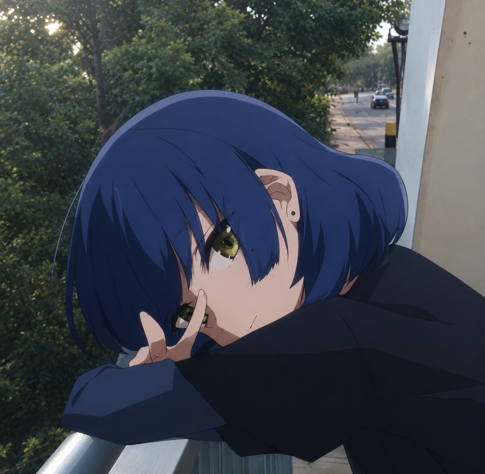

# Images

Everything in `assets/img/` right now is a placeholder I generated. The site looks
finished with them, but it'll look like *yours* once you swap them.

Keep the filenames the same and nothing else needs changing. If you'd rather use a
different name or format, update the matching `src` in `index.html`.

| File | Where it shows | What to use | Good size |
| --- | --- | --- | --- |
| `avatar.png` | the big circle at the top | your profile picture | square, 400×400 or larger |
| `favicon.svg` | browser tab icon | a simple mark, readable at 16px | square |
| `og.png` | Discord / Twitter link previews | a wide image with your name on it | 1200×630 |
| `project-ddfc.png` | DDFC card | screenshot or render | 16:9, 1280×720 |
| `project-vcap.png` | VCap Motion card | screenshot or capture footage still | 16:9, 1280×720 |
| `project-website.png` | This website card | screenshot of the site itself | 16:9, 1280×720 |
| `project-bo.png` | Borderline Obsession card | a still or title card | 16:9, 1280×720 |

## Swapping a photo in

Everything above except the favicon is already a PNG, so the easy path is: rename your
photo to match — `avatar.png`, `project-ddfc.png`, and so on — and drop it into
`assets/img/`, overwriting the placeholder. No HTML edit needed.

If you'd rather keep your own filename, or you're working from a JPG, open
`index.html` and update the matching tag instead. The avatar is here:

```html

```

and the project cards are the `` inside each `<div class="proj-media">`. Change
the `src` to whatever your file is actually called — `avatar.jpg`, `photo.png`,
anything — as long as it's sitting in `assets/img/`.

## Things worth knowing

- Project images are cropped to 16:9 and centred. Keep the important bit near the middle.
- The avatar is cropped to a circle. Faces slightly above centre look best.
- Anything over about 400 KB will slow the page down. Run photos through
  [squoosh.app](https://squoosh.app) first.
- `og.png` genuinely has to be a PNG or JPG. Discord and Twitter won't render an SVG.

## Want a hero background?

There's room for one behind the name — a Minecraft cinematic frame or a Forza photo
would suit it. Tell me and I'll wire it in; it needs a dark overlay so the text stays
readable, which is a few extra lines of CSS rather than a drop-in.
